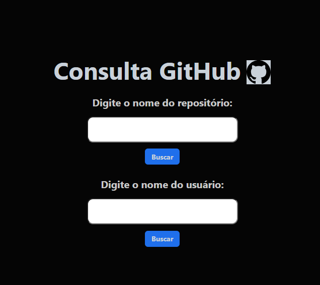
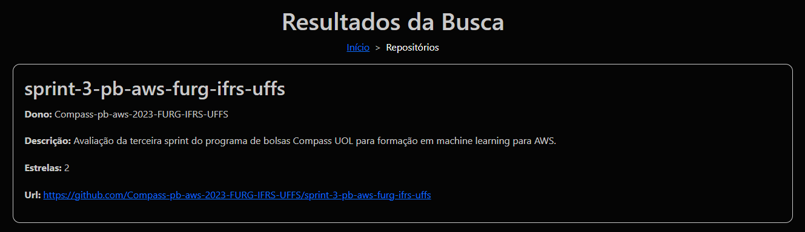

<h1 align="center"> Avaliação Sprint 3 - Equipe 4 </h1>


## API
Para realização da atividade proposta optamos por continuar utilizando a API do GitHub, trazendo novas funcionalidades a aplicação:<br>
[GitHub](https://docs.github.com/pt/rest?apiVersion=2022-11-28)

## Tecnologias
      <br>

## Docker 
Foi utilizado um container de NodeJS, onde foi incluído o arquivo package*.json, instalado as dependências do projeto, e a porta 3000 foi exposta. <br>
Afim de simular um ambiente de produção foi utilizado docker-composer.<br>
[Link da imagem](https://hub.docker.com/r/johnmarcelsilveira/sprint3-equipe-4)  

## AWS
Foi criada uma instância EC2, utilizando debian como sistema operacional e docker instalado, para possibilitar o acesso a aplicação, a porta 3000 da EC2 foi exposta.<br>
Foi realizado o download da [imagem](https://hub.docker.com/r/johnmarcelsilveira/sprint3-equipe-4) na EC2 instanciada. <br>
A aplicação foi inicializada através do comando:<br>
```sudo docker run --name sprint -p 3000:3000 -d johnmarcelsilveira/sprint3-equipe-4``` <br>

<h1><p align="center">Fluxograma da Aplicação<br> </p></h1>

## Clone 
Para clonar a branch utilize o seguinte comando no terminal: <br> 
```git clone --branch equipe-4 https://github.com/Compass-pb-aws-2023-FURG-IFRS-UFFS/sprint-3-pb-aws-furg-ifrs-uffs.git``` 

## Acessar Aplicação
No navegador e sua preferência, acesse o endereço abaixo: <br>
 [Consulta GitHub](http://54.242.152.68:3000)

## Descrição 

Para a conclusão da Sprint 3 foi proposta implementação do projeto na [Sprint 2](https://github.com/Compass-pb-aws-2023-FURG-IFRS-UFFS/sprint-2-pb-aws-furg-ifrs-uffs/tree/equipe-4), com a utilização de Docker e publicação através da AWS Cloud. <br>
Tomou-se como ponto de partida o projeto entregue na [Sprint 2](https://github.com/Compass-pb-aws-2023-FURG-IFRS-UFFS/sprint-2-pb-aws-furg-ifrs-uffs/tree/equipe-4), buscando trazer melhorias e novas funcionalidades na aplicação. <br>
Poderá ser realizado dois tipos de consulta: Reposítório e Usuário.<br><br>
Ao realizar a busca por Repositório, serão apresentadas as seguintes informações:<br>
* Nome do Repositório;<br>
* Dono do Reposítório;<br>
* Descrição do Repositório;<br>
* Avaliação do Repositório.<br>
* URL.<br>

Ao realizar a busca por Usuário, seram apresentadas as seguintes informações: <br>

* Avatar; <br>
* Usuário;<br>
* Link para o GitHub do usuário;<br>
* Nome do usuário;<br>
* Data de criação do perfil; <br>
* Quantidade de seguidores;<br>
* Lista dos repositórios do usuário. (Nova funcionalidade)<br>

## Front-end
<h1><p align="center">Início<br> </p></h1>
<h1><p align="center">Busca Repositório<br></p></h1>
<h1><p align="center">Busca Usuário<br></p></h1>

## Arquitetura
* ```src```
    * ```public```
        * ```css```
            * ```index.css```
            * ```notFound.css```
            * ```repos.css```
            * ```styles.css```
            * ```usuario.css```
        * ```img```
        * ```dir.js```
        * ```index.html```    
    * ```server```
        * ```routes```
            * ```apiRoutes.js```
            * ```repositoryRoute.js```
            * ```userRoute.js```   
        * ```services```
            * ```getRepo.js```
            * ```getReposUser.js```
            * ```getUser.js```  
        * ```index.js```      
    * ```views```
        * ```breadcrumb.ejs```
        * ```notFound.ejs```
        * ```repos.ejs```
        * ```usuario.ejs```
    * ```app.mjs```
    * ```entry.js```
* ```docker-compose.yaml```

## Utilização 
* Na página inicial há duas opções de pesquisa:
    * Repositório
    * Usuário
* Escolha um dos campos e preencha conforme o indicado;<br>
* Clique no botão "buscar", abaixo do campo selecionado;<br>
* A aplicação irá realizar a consulta solicitada pelo usuário:
    * Em caso de escolha de buscar por repositórios, serão exibidos 5 repositórios que possuam o nome informado na busca;
    * Em caso de escolha por busca usuário, serão exibidas as informações relativas ao usuário correspondente. 

## Dificuldades Conhecidas
Nesta etapa do projeto não foram encontradas dificuldades.

## Integrantes

- 🔨 Fabiano Mendonça
- 🔨 John Marcel Silveira
- 🔨 Rafael Pinheiro
- 🔨 Yuri Souza

| [<br><sub>Fabiano Mendonça</sub>](https://github.com/FabianoMendonca) | [<br><sub>John Marcel Silveira</sub>](https://github.com/JohnMarcelSilveira) | [<br><sub>Rafael Pinheiro</sub>](https://github.com/RafaMPinheiro) | [<br><sub>Yuri Souza</sub>](https://github.com/Zeeneboch) |
| :--------------------------------------------------------------------------------------------------------------------------------------------: | :---------------------------------------------------------------------------------------------------------------------------------------------------: | :-----------------------------------------------------------------------------------------------------------------------------------------: | ---------------------------------------------------------------------------------------------------------------------------------- |
