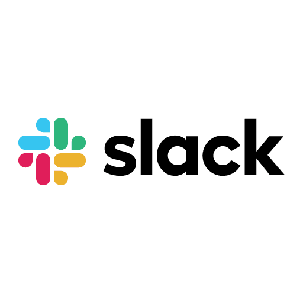
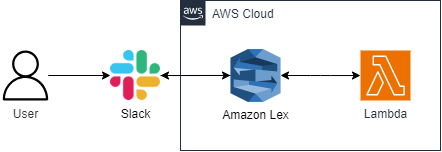

  

  <h1>UOL Bank</h1>

  <h2>UOL Bank - Seu assistente bancário</h2>

  
Conheça a incrível equipe por trás deste projeto

  <table>
    <tr>
      <td align="center">
        <a href="https://github.com/angemydelson">
           
          <b>Angemydelson Saint Bert</b>
        </a>
      </td>
      <td align="center">
        <a href="https://github.com/FeMarzani">
           
          <b>Felipe Marzani da Silva</b>
        </a>
      </td>
      <td align="center">
        <a href="https://github.com/RafaMPinheiro">
           
          <b>Rafael Messias Pinheiro</b>
        </a>
      </td>
    </tr>
  </table>

## 📺 Acesso da Aplicação

- Para acessar a aplicação, clique no nome do Bot a seguir: **[UOL Bank](https://join.slack.com/t/uol-bank/shared_invite/zt-237mo74t3-99cCzoc1kxT0erS6KVNhBQ)**

## 1. Propósito

O objetivo do trabalho foi a realização de um ChatBot com tema livre. Dessa forma, realizou-se a criação do UOL Bank.
O UOL Bank é um assistente de serviço bancário que possui como serviços geração de extrato bancário, transferência, empréstimo e cancelamento de cartão. Sua interação está organizada da seguinte forma nas intenções:
- Saudações;
- Extrato;
- Cancelamento;
- Empréstimo;
- Transferência;
- Encerramento;

A interação com o Bot pode ser iniciada com qualquer palavra ou frase de interação, ou simplesmente palavras que falam diretamente da intenção, como por exemplo:
- "Olá"
- "Oi"
- "Bom dia"
- "Gostaria de tirar um extrato"
- Etc...
 
A cada interação feita com base em intenções, o Bot solicitará algumas informações para dar seguimento à interação. Como por exemplo:
- Email cadastrado
- Senha de 4 dígitos 
- Tipo de conta de cartão
- Etc...

### 1.1 Ferramentas Utilizadas
 

    
    
    
  

## 2. Passo a Passo de Criação
Toda a estrutura do Bot foi feita seguindo a interface do Amazon Lex e integrando a versão final com o Slack.
- Criou-se o bot e se configurou sua estrutura geral de interação, como as Intents e os Slots. 
- Utilizou-se de Response Cards em algumas intenções feitas. 
- Buildando a ultima atualização do bot, estruturou-se uma última versão e se gerou um Alias para realizar a integração de canais.
- A partir disso se criou um canal para a configuração do Slack, gerou-se os endpoints e se realizou a conexão com a plataforma do Slack. 

## 3. Estrutura de Diretórios
- **assets**
  - `lex.png`
  - `logo.png`
  - `slack.png`
- **lex**
  - `UOL-Bank.zip`
  

## 4. Infraestrutura na AWS

   

## 5. Desafios Enfrentados
- O principal desafio encontrado foi em relação a adaptação da interface do Lex, contudo com o tempo e prática de realização de intents e slots se foi conseguindo realizar a atividade.
